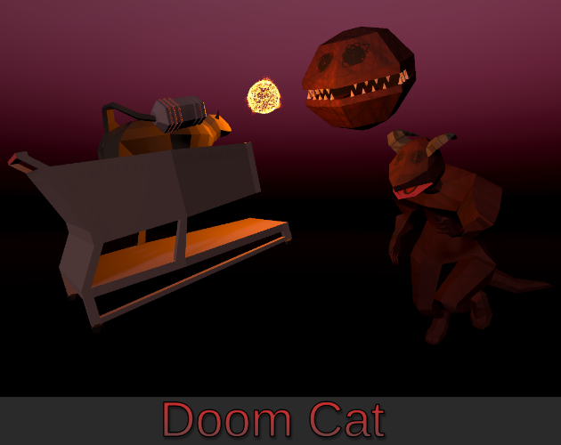

# Doom Cat

    

This is my submission for GMTK 2020, a 2 day gamejam with a theme of "Out of Control". Ram and shoot demons as a cat in a shopping cart~

You can download the game for free [here, on itch.io](https://request.itch.io/doom-cat). Since my Rift's headset is currently broken, I was only able to make a pancake game this time around. 
On the bright side, the replacement cable comes in this week~

You're free to do whatever with this code, but if you do use it, it'd be real cool of you to link back to this page or the itch.io page (or both). Thanks!

## About

This game takes place in 203X - The demon slayer has found new passions, and is unavailable. But who will take their place to fight off hordes of demons?

Enter you, a cat in a shopping cart, with a blaster gun on your tail. How you manage to wield these weapons? No one knows! But you can certainly do it in style -
You can blast a demon in its stupid face, then do a sick kickflip and drift away in style~

### Some topics of interest in this repo

  * Sphere-based car locomotion, based off of the logic in [this twitter post by Nitroneers](https://twitter.com/Nitroneers/status/1238779466832363520).
    * I've adapted this logic to let the player jump, and do simple flip tricks (rotate along the forward axis, or the up axis)
  * Simple third-person camera using Cinemachine. I'm also using this as the basis of the aiming logic (the blaster aims at a point along the camera's forward vector)
  * Simple usage of unity's Animation Rig (large demon turns from the hip upwards to face the player)
  * Simple timer-based enemy spawner. 
    * It picks a random volume from a list, and picks a random position in that volume. From there, we raycast downwards to the ground, and spawn an enemy there if the surface is valid (ie: marked as spawnable ground)
 
Some other minor things that I played around with for the first time, but aren't as flashy:
  * Creating my own complex models (everything except the 3d kitchen models). The main cool things were modeling/rigging/and texturing the cat and demons, even though I didn't end up animating much
  * Creating my own 8-bit sound effects via famitracker
  
### Next Steps

If I had more time (always the case with these game jams), I'd focus on these things first:
  * Faster-paced gameplay. 
    * Enemies should spawn in the same area as the player, not just a random area chosen by chance
    * Incentify aggressive gameplay from the player. Maybe drop health packs when the player rams an enemy? Currently, the best strategy is to kite the enemies, or hide in a high up area.
    * Sphere enemies should jump at the player if they get stuck, or if they're below the player
  * Better colliders on the terrain. The player falls through the ground too easily. Add a solidify modifier to the model in blender?

## Assets

This time around, I tried to make most of the assets myself (3D modeling and audio design are still new to me). The only borrowed assets in the final build for this game are the BGM, and the 3D kitchen assets in the main menu.

  * Engine: Unity 2019.3.3f1
	  * URP
	  * TextMeshPro
    * Cinemachine
  * BGM: [NES Shooter Music by SketchyLogic](https://opengameart.org/content/nes-shooter-music-5-tracks-3-jingles), licensed under [CC0 1.0 Universal](https://creativecommons.org/publicdomain/zero/1.0/)
  * Kitchen Assets: [Ultimate House Interior Pack by Quaternius](https://www.patreon.com/posts/ultimate-house-38448096), licensed under [CC0](https://creativecommons.org/share-your-work/public-domain/cc0/)
  * Pretty sure I might still have some textures from [Kenney's Voxel Pack](https://www.kenney.nl/assets/voxel-pack) as a ground texture in my greybox level. Licensed under [CC0 1.0 Universal](https://creativecommons.org/publicdomain/zero/1.0/)
  * Used a screenshot of [Helltaker](https://store.steampowered.com/app/1289310/Helltaker/) as a reference for an image
